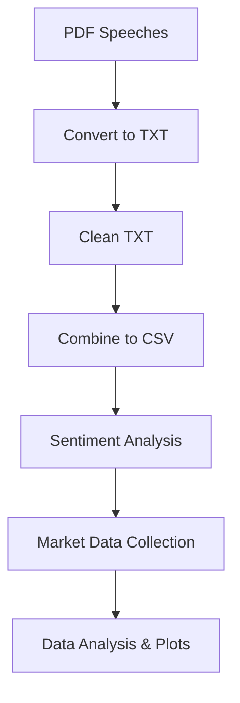

# 🏦 RBI Speech Sentiment Analysis & Market Impact

Analyze how RBI (Reserve Bank of India) Governor's speeches affect Indian stock markets (NIFTY & SENSEX) using sentiment analysis and market data.

---

## 🚀 Quick Start

1. **Clone the repo & set up your environment**
2. **Install dependencies:**
   ```bash
   pip install pandas numpy matplotlib seaborn statsmodels scipy yfinance
   ```
3. **Run the scripts in order:**
   ```bash
   python 1_convert_pdf_to_txt.py
   python 2_text_cleaning.py
   python 3_combining_txt\ speeches_to\ csv.py
   python 4_sentiment_analysis_of_rbi_text_speeches.py
   python 5_acquiring_financial_data_around_rbi_speeches.py
   python 6_data_analysis.py
   ```
4. **View results:**
   - Analysis CSVs: `nifty_analysis_results.csv`, `sensex_analysis_results.csv`
   - Plots: See the `plots/` folder

---

## 📊 Workflow Overview



---

## 🗂️ What Each Script Does

| Script | Purpose |
|--------|---------|
| `1_convert_pdf_to_txt.py` | Converts RBI speech PDFs to text files |
| `2_text_cleaning.py` | Cleans and preprocesses the text files |
| `3_combining_txt speeches_to csv.py` | Combines cleaned texts into a single CSV |
| `4_sentiment_analysis_of_rbi_text_speeches.py` | Analyzes sentiment of each speech |
| `5_acquiring_financial_data_around_rbi_speeches.py` | Downloads NIFTY/SENSEX data around each speech date (extracts date from `Speech_Date` column) |
| `6_data_analysis.py` | Analyzes sentiment vs. market returns, creates plots |

---

## 📁 Key Files & Folders

- `cleaned_rbi_speeches.csv` — Main speech data (with `Speech_Date` column)
- `rbi_speech_sentiments_vader.csv` — Sentiment scores
- `nifty_3days_before_after_speech.csv`, `sensex_3days_before_after_speech.csv` — Market data (auto-generated)
- `plots/` — All generated visualizations
- `rbi_speeches_txt_clean/`, `rbi_speeches_txt/`, `rbi_speeches_raw/` — Raw and processed speech texts

---

## 📝 Notes
- All files are kept for reproducibility.
- The workflow is modular: you can rerun any step if you update the data.
- The script for market data (`5_acquiring_financial_data_around_rbi_speeches.py`) automatically extracts the date from the `Speech_Date` column (e.g., '2025-03-28 Swaminathan J.').

---

## 🛠️ Troubleshooting
- **Missing dependencies?** Run the pip install command above.
- **Date parsing errors?** Ensure your `cleaned_rbi_speeches.csv` has dates in the first 10 characters of `Speech_Date`.
- **File not found?** Check that all scripts are run from the project root directory.

---

## 📬 Contact
For questions or suggestions, open an issue or contact the maintainer. 